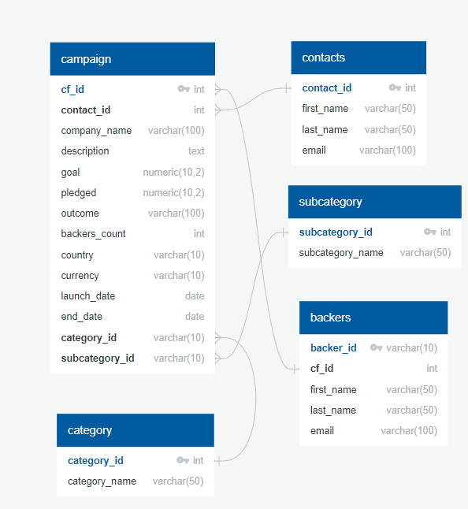

# Crowdfunding-ETL
Module 8 Analysis
## Overview of Project
Independent Funding is a crowdfunding platform for funding independent projects or ventures. They want to move all of their accesible data from Excel to PostgresSQL. We will be extracting and transforming data from large Excel files to CSV files to create a PostgreSQL database and tables by using ERDs.

## Purpose
We will be performing SQL queries to generate reports for stakeholders of information about the backers who've pledged to the live projects.

## Results
### Extract the Data
Using Python and Pandas, we begin exctracting and transforming the raw data into a DataFrame. After extracting the raw data, creating columns, and separating the names into two different columns, this is what our new DataFrame looks like. 

### ERD
The following is our Entity Relationship Diagraph for all data.

### SQL Analysis
#### Backers Count
We began the SQL Analysis by finding the number of backers in descending order for each "cf_id" and all live campaigns. We pulled this information from our campaign table and our backers table to make sure our data matched.

  

#### Email Contacts
We created a table with email, contact information, and remaining goal amount in order to email each contact of every live campaign informing them how much of the goal remains.

To conclude, a table was also created to email the backers how much of the goal remains for each live campaign. The following code was used, 

'''SELECT
	ba.email,
	ba.first_name,
	ba.last_name,
	ba.cf_id,
	ca.company_name,
	ca.description,
	ca.end_date,
	(ca.goal - ca.pledged) AS "Left of Goal"
INTO email_backers_remaining_goal_amount
FROM backers AS ba
LEFT JOIN campaign AS ca
ON (ba.cf_id = ca.cf_id)
ORDER BY email DESC;
'''

Independent Funding has all the databases and tables needed in PostgreSQL to inform their contacts with the progress of all crowdfunding campaigns.
